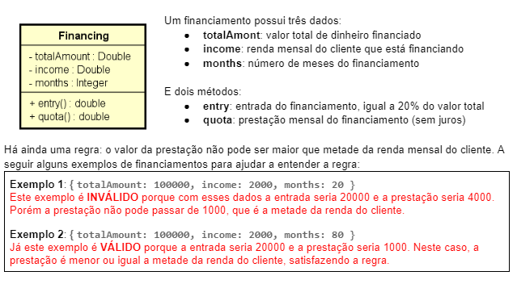

# Execicio java e teste

Fundamentos de testes unitarios

## Teste unitário

Teste feito pelo desenvolvedor, responsável por validar o comportamento de unidades funcionais de código.
Nesse contexto, entende-se como unidade funcional qualquer porção de código que através de algum estímulo
seja capaz de gerar um comportamento esperado (na prática: métodos de uma classe).
Um teste unitário não pode acessar outros componentes ou recursos externos (arquivos, bd, rede, web services, etc.).

### Beneficios

* Detectar facilmente se mudanças violaram as regras
* É uma forma de documentação (comportamento e entradas/saídas esperadas)
* Redução de custos em manutenções, especialmente em fases avançadas
* Melhora design da solução, pois a aplicação testável precisa ser bem delineada

### Boas práticas e padrões
- Nomenclatura de um teste: ```<AÇÃO> should <EFEITO> [when <CENÁRIO>]```
* Padrão AAA
  * Arrange: instancie os objetos necessários
  * Act: execute as ações necessárias
  * Assert: declare o que deveria acontecer (resultado esperado)


### Exercicio proposto:


### Cenários de Teste

* Construtor
  * Deve criar o objeto com os dados corretos quando os dados forem válidos
  * Deve lançar IllegalArgumentException quando os dados não forem válidos

* setTotalAmount
  * Deve atualizar o valor quando os dados forem válidos
  * Deve lançar IllegalArgumentException quando os dados não forem válidos

* setIncome
  * Deve atualizar o valor quando os dados forem válidos
  * Deve lançar IllegalArgumentException quando os dados não forem válidos

* setMonths
  * Deve atualizar o valor quando os dados forem válidos
  * Deve lançar IllegalArgumentException quando os dados não forem válidos

* entry
  * Deve calcular corretamente o valor da entrada

* quota
  * Deve calcular corretamente o valor da prestação
